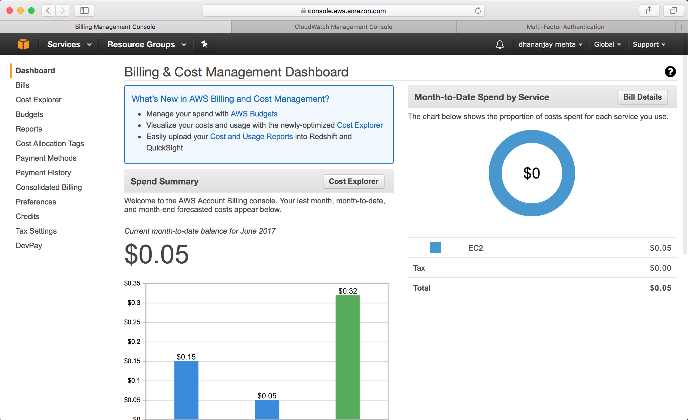
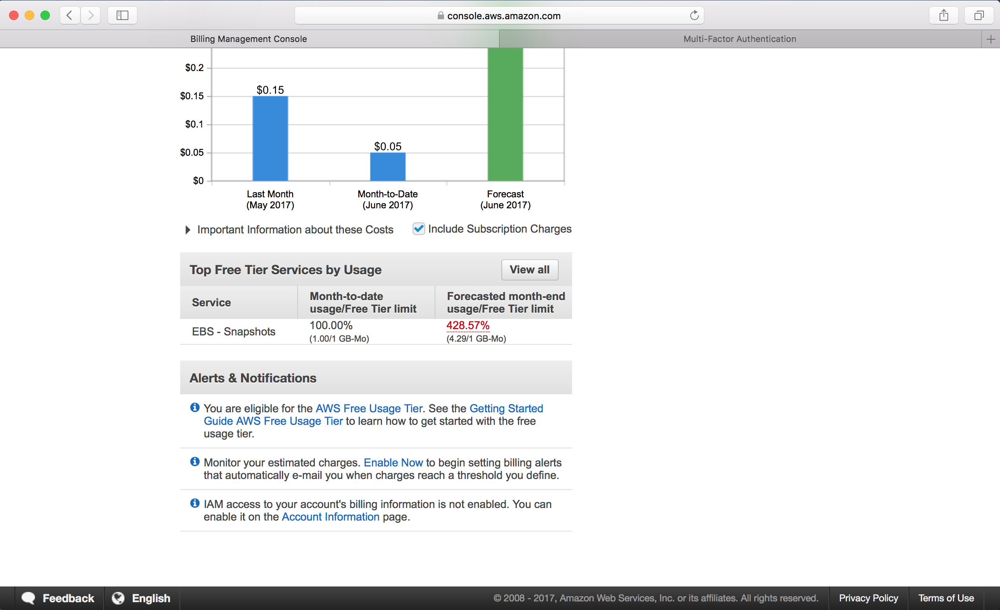
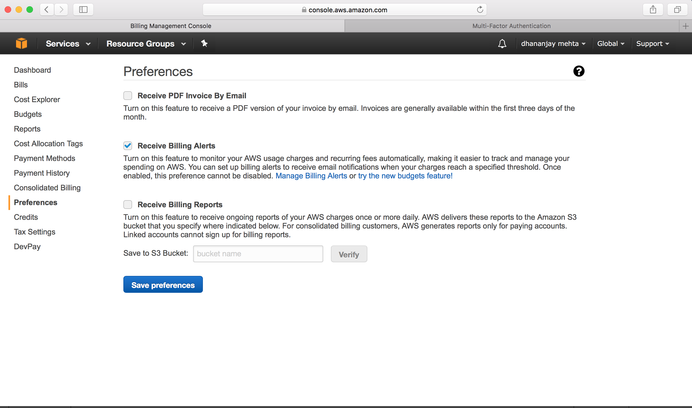
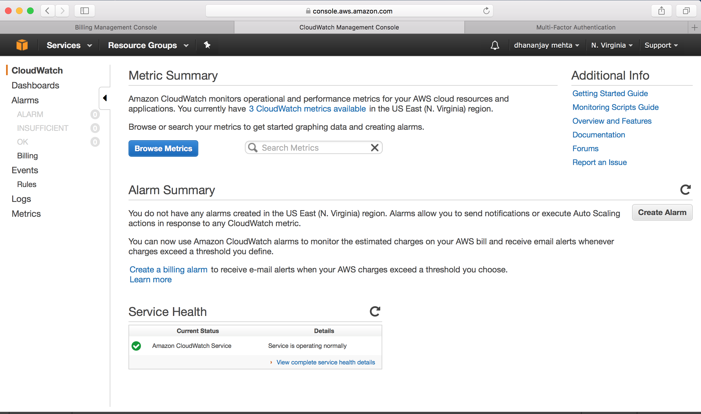
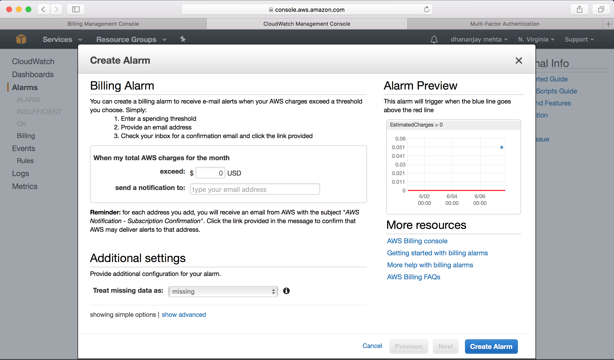
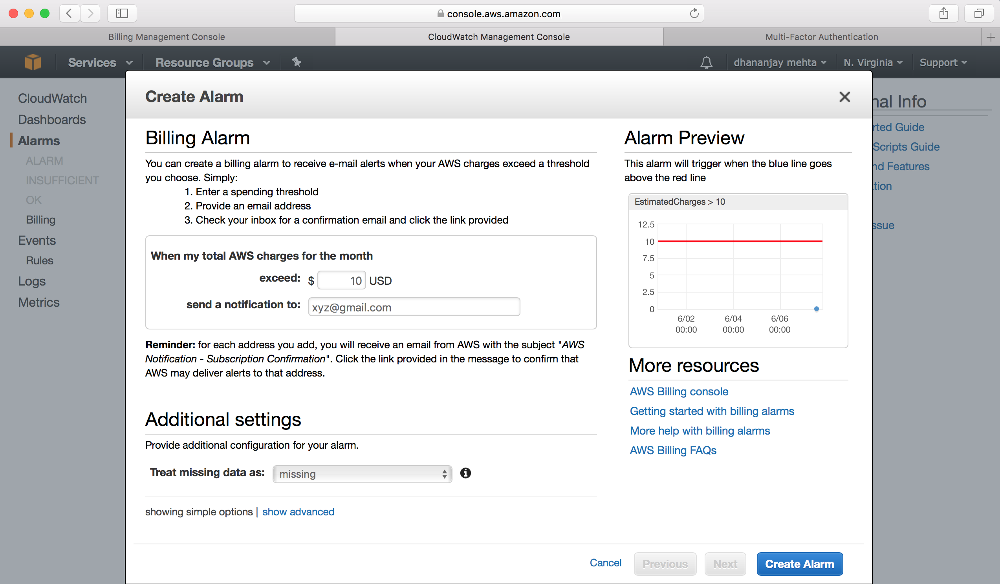
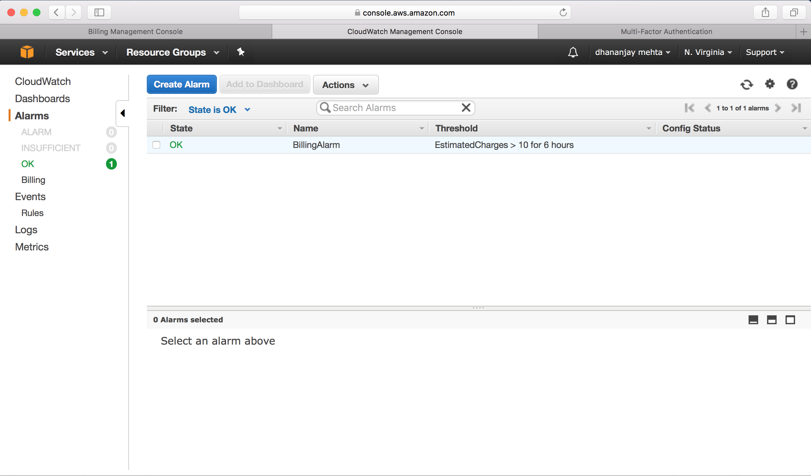

## AWS: Billing Alarm

A billing alarm can be set up on AWS to make sure that the admin is notified if the bills cross certain threshold. This allow to manage the resources before the cost cross threshold, this also allow the admin to keep note of the load on the resources. Below are the steps to set up a billing alarm on AWS.

**Step 1.** Go to Billing Dashboard
 

**Step 2.** Go to alert and notification and then click enable monitoring of the charges and billing.
 
 
**Step 3.** Set up the preference to receive billing alerts
 
 
**Step 4.** This direct you to CloudWatch Service, and click create alarm
 

**Step 5.** Set up desired threshold for the billing
 
 
 
 
 **Step 6.** After verification of the alert email account (can be done later), account will be set up.
 