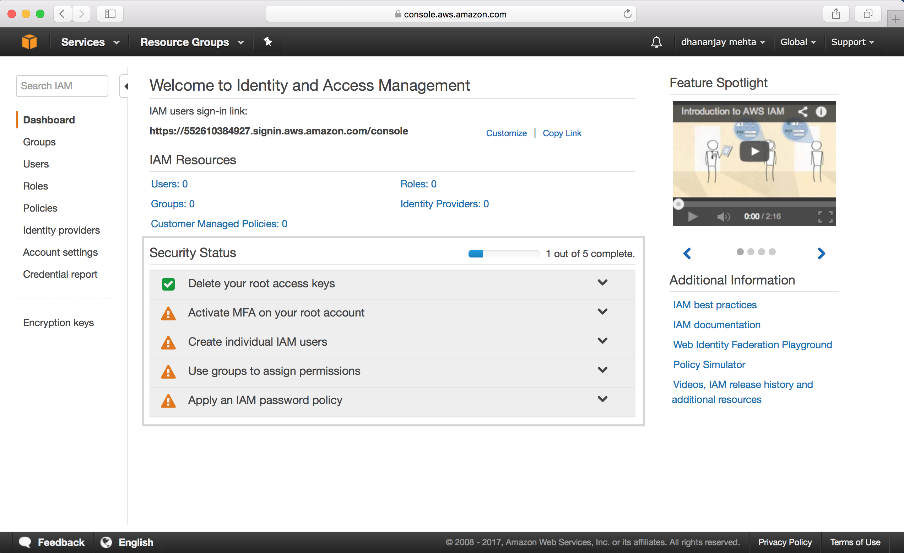
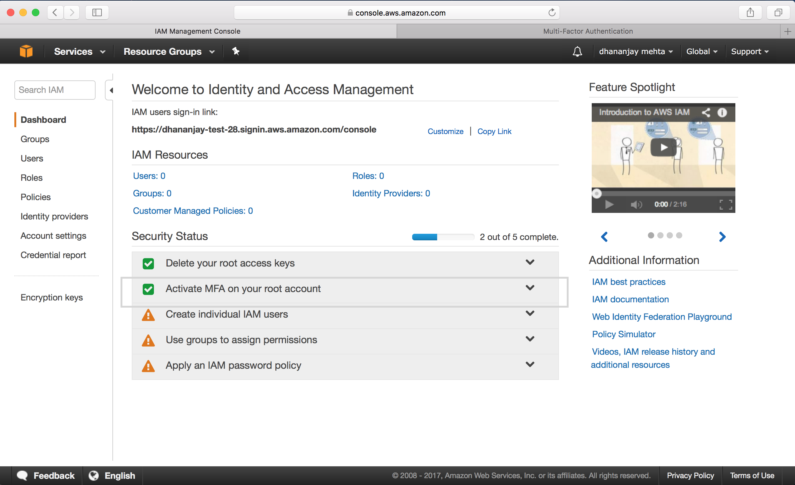
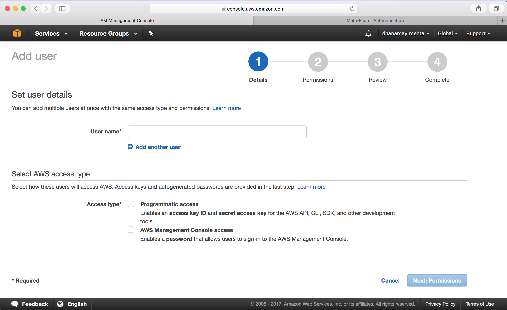
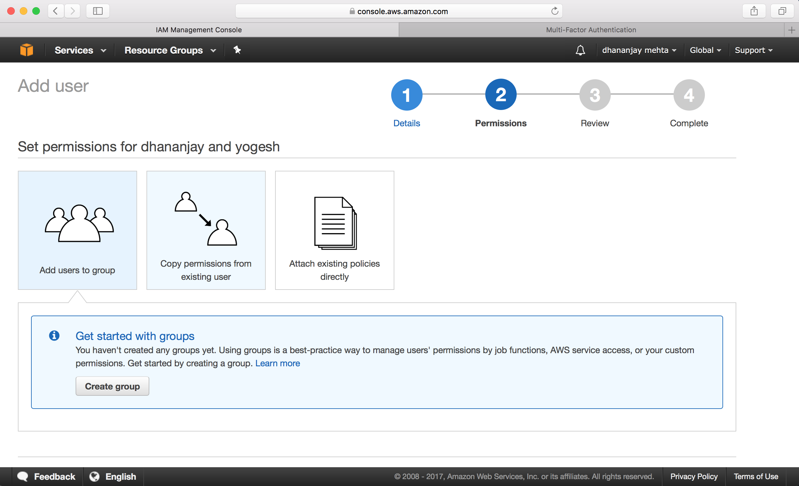
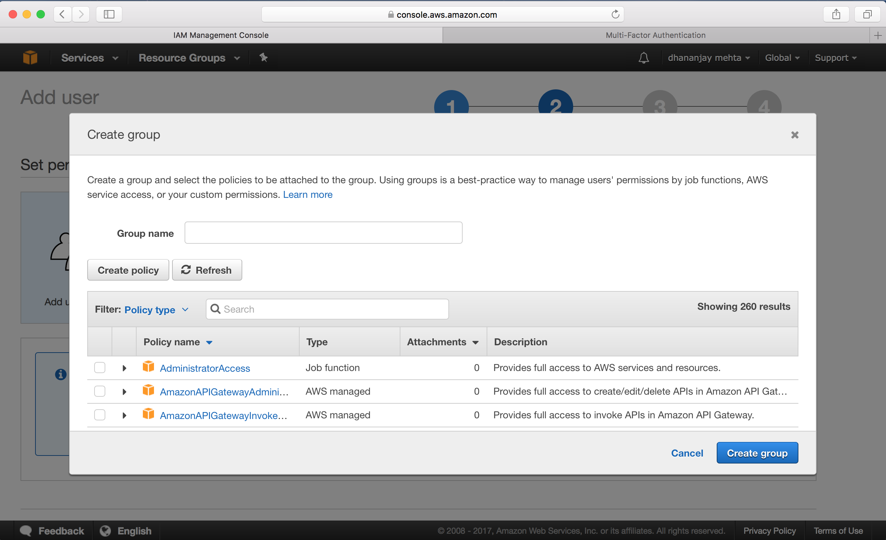
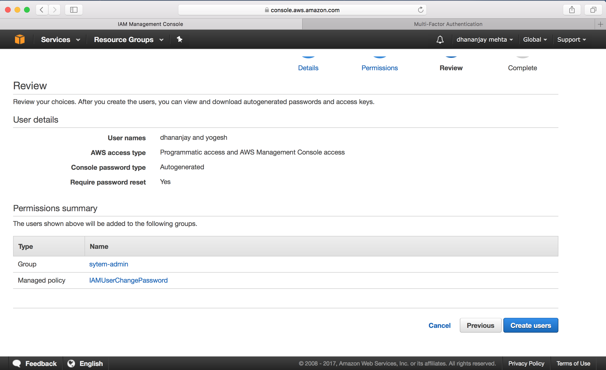
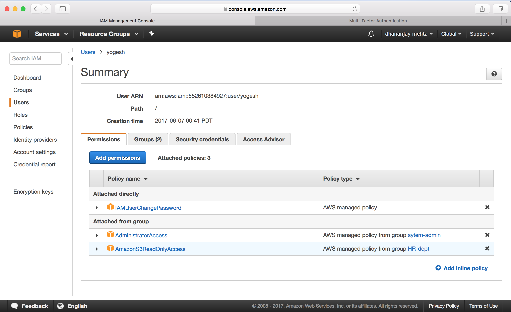
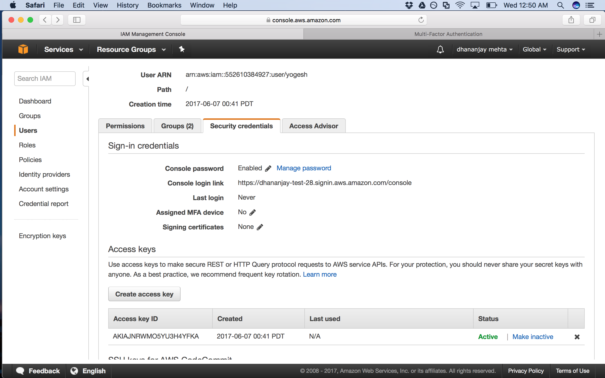
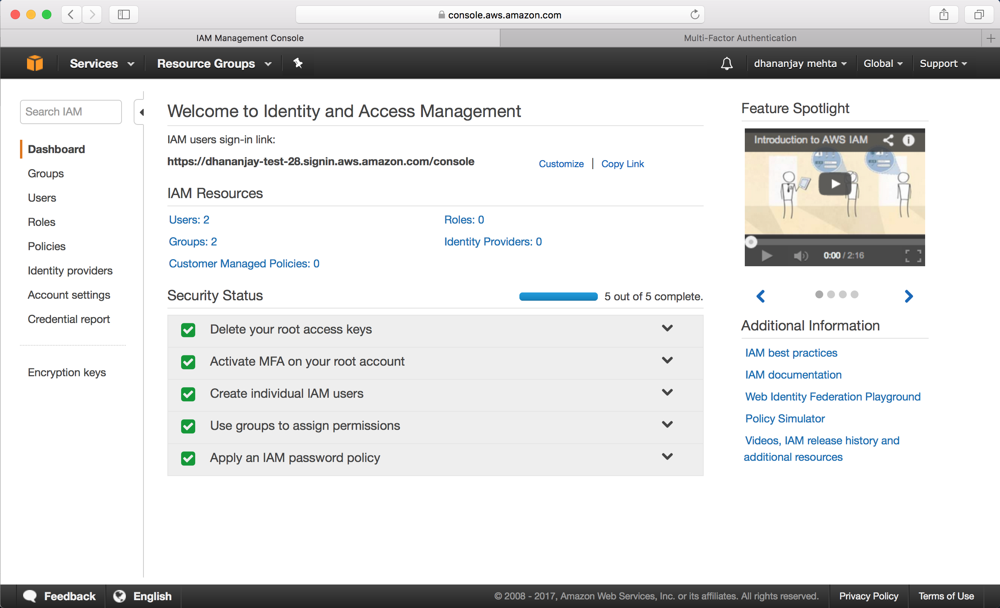

## AWS: Identity Access Management

**What is IAM?**
- AWS Identity and Access Management (IAM) is a web service that helps you securely control access to AWS resources for your users. You use IAM to control who can use your AWS resources (authentication) and what resources they can use and in what ways (authorization).
- IAM is a feature of your AWS account offered at no additional charge. You will be charged only for use of other AWS services by your users.

**What does IAM provide?**
- Centralized control of AWS account
- Shared Access of AWS account
- Granular permissions for individual user or service
- Identity Federation (including active directory, facebook, linkedin, google linking)
- Allow multi-factor authentication
- Provide temporary access to devices , services
- Allow to set up password rotation policy
- Support PCI-DSS compliance

**Important terms in IAM?**
Users - End users
Groups - Groups or departments in office
Roles - Roles can be created and then assigned to AWS resources. Eg. A role can be defined for EC2 instance to process data and load to S3
Policies - Policiy documents define the rules and permissions. 

**Setting up IAM**
Security
- IAM is a global feature, it is not bound to a region
- IAM users sign in link consist of the AWS account number of parent account 
e.g. https://552619384927.signin.aws.amazon.com/console
This login link can be set to customized link => https://dhananjay-test-28.signin.aws.amazon.com/console
- Set up multifactor authentication for root user
 
Following are the steps for setting up the IAM:

**Step 1:** IAM in the AWS Dashboard
 

**Step 2:** IAM Dashboard 
 

**Step 3:** Activate Multifactor Authentication on the root
  

**Step 4:** Add new IAM Users

**Step 5:** Set type of access for each user.

**Step 6:** Add users to groups
 

**Step 7:** Assign different privileges to user groups
 

**Step 8:** Review permissions for group

**Step 9:** Users are added successfully with access assigned to users.

**Step 10:** Users can be added to more than one groups and granted additional permissions.

**Step 11:** Access can be revoked for a user or can be made inactive

**Step 12:** Admin can set up a password policy for the users

**Step 13:** After all the 5 fields are green IAM is good.
 
 
 
 