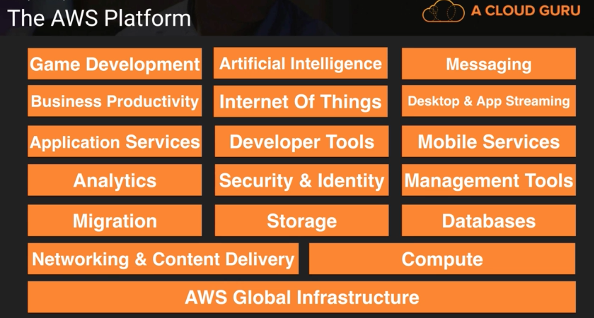

## AWS: Platform & Services
AWS cloud platform can be categorized broadly into three main models for cloud computing:
1. Infrastructure as a Service (IaaS): It provide access to networking features, computers (virtual or on dedicated hardware), and data storage space.
2. Platform as a Service (PaaS): It helps organizations to be more efficient as they don’t need to worry about resource procurement, capacity planning, software maintenance, patching, or any of the other undifferentiated heavy lifting involved in running their application.
3. Software as a Service (SaaS): It provide a completed product that is run and managed by the service provider. User do not have to think about how the service is maintained or how the underlying infrastructure is managed; you only need to think about how user will use that particular piece software.

All the services offered by AWS fall in one of the above categories. Below are are set of different services that are provided by AWS:

### Infrastructure Services:
AWS infra is split into Regions and Availability Zones

Regions(R): A geographic area where AWS resources exist, currently 15. Each R contains 2 or more AZ and these AZ provide the services

Availability Zones(AZ): A physical data center, nearly 35

Edge Location: A content delivery network, that can be used to cache the data/content for user. It is the CDN endpoint for AWS Cloudfront. There are nearly 66 Edge Location

#### VPC: 
It is a virtual Data Center in all the regions, multiple VPC / region.
Note: Very Important

#### Route 53:  
Amazon DNS service, Route + 53< here 53 is DNS port> and route is after route 66

#### Cloud Front: 
Caching and CDN service for large files and media services

#### Direct Connect: Dedicated line connection, this service is not used to reduce reliability on Internet

#### EC2 / Elastic Compute Cloud: 
This is virtual machine on AWS, provide compute resources
EC2 Container Service (ECS) - Its basically a docker instance

#### EBS / Elastic Bean Stalk: 
this is used to deploy and manage applications and code to AWS. 
EBS will review the application and automatically detect deployment requirements, autoscaling, load balancing, health monitoring.
Use other services such as EC2, S3, ELB,  Autoscaling to deliver highly reliable, scalable and cost-effective infrastructure
AWS cloud watch can be used to monitor the status and health and requirements of the application.

#### Lambda: 
Allow to run application without need of a Server.
The code is run whenever there is new data, or a new trigger for code. no charges for ideal time
Good for real time data processing.
Good for Not, mobile or Web apps
Benefits: No server to manage or maintain, pay per use, no charge for idle time
Trigger for Lambda can be generated by either kinesis, S3, Simple Notification Service, DynamoDB to trigger Lambda operation. This is due to any incoming load or change in the state
Charging - Every 100ms code runs, or every trigger for the code.

#### Light sail: 
Allow users to deploy basic websites on Joomla or Wordpress if they do not have much experience with AWS

### Storage Services
Has  4 components - 

#### S3 / Simple Storage Service :
Used to store objects on cloud 

#### Glacier:
Archive files off S3 to it
Store these files for long time, extremely low cost.
Very slow retrieval time <3-4 hr>

#### AFS / Elastic File System:
This is Block based service
This can be shared between different systems on EC2 which can access the file simultaneously and update it.
Similar to Google sheet/slide
Pay only for files and directories used, no minimum fee or setup charge
Durable and high availability, replicate in different AZ in a region

#### Storage Gateway Service:
This service connects S3 to on premise data-center
Its a image that can connect with the S3.

### Databases Services

#### RDS <Relational Database Storage>: Important
Offer relational data storage, with following flavors : MySql, MariaDB, PostgresQL(2016), Aurora, Oracle
Have pre-configured image of all the database, does not require need of an adminstrator

#### DynamoDB <Non Relational NoSQL DB>:
This is No SQL data system, it offers scalable storage
Competitors: Cassandra, MongoDB

#### Aurora:
- Amazon’s own relational database system.
- Have a mySQL compatible storage engine
- provide 5 time throughput compared to current RDBMS
- 1/10 cost of existing enterprise solutions and no license fee
- Read heavy applications can increase availability with data replicated across servers in less than 10ms
- Security: network isolation using VPC, data encryption in rest through AWS key management, data encryption in motion by SSL
- automated backups, snapshots and create replicas for data
- Compatible with MySQL 5.6 using InnoDB storage engine , any code used with MySQL can be used with it.
- Can replace Oracle, Postgres, SQL Server
- AWS DMS and AWS Schema Conversion tools can be used to migrate the data to Aurora
- Offer high availability, failover < 30sec, 6 copies replicated across 3 AZ and copies replicated on S3 

#### Redshift < Data Warehouse Solution>:
Its data warehouse for storage of big data
Running queries on production system make it slow, so queries can be run on a data warehouse for the purpose of analytics. 
Competitors: Vertica,  Terradata
Store in columnar format, parallel process data, OLAP Database

#### Elastic Cache <Caching Storage>:
Allow fast data retrieval through data stored in memory caches, its in memory data cache system
E.g. If user is interested in top 10 items in a store, it can get the result directly from cache.
Can help to improve performance of read heavy applications as  it reduce latency in returning results.
It will take care of persistence itself
Use following open source engines - Memcached / Redis for task
Redis: Good to store data which is structured with common use cases as  - Leaderboards, Counting, Tracking, session management. Redis vs Memcached: https://stackoverflow.com/questions/10558465/memcached-vs-redis
On demand nodes,

### Migration Services

#### Snowball:
- import export data over hard disk and move data on cloud
- Hardware appliance that copy data and move to S3
- It has been extended to on premise data center

#### DMS<Database Migration Service>:
- allow to migrate on premise database to cloud
- allow to move data from RDS to redshift or other region
- allow to migrate from one DB to other DB eg. Oracle to AURORA
- There is no downtime in migration

#### SMS <server migration service>
- allow to migrate the virtual machines on ec2
- no downtime

### Analytics Services

#### Athena:
- Most data is stored in S3 in multiple data format.
- This data was needed to be transformed by ETL process before being used
- Also , data needed to be aggregated before it is used if a user is not planning to use Hadoop for parallel processing.
- Athena is interactive query services which allow to query data directly from S3 using SQL.
- It is serverless, no infrastructure needed, no instance, no administration needed.
- User talk to Athena using console, or using JDBC driver.
- Allow to query CSV, txt
- This include two basic steps: Create table from data sitting on S3, query the data.
- No loading of data is required form any database, no ETL required
- Load data (csv, txt, json, weblogs, service logs) to S3 => process data on Athena
- Note: If data is converted to Parquet or ORC, this will give the best result with lowest cost.
- Underlying technologies include: Presto(allow in memory distributed query processing), Hive(used for DDL Queries)

ref: https://www.youtube.com/watch?v=ihVI-MZ6xR0

#### EMR<Elastic Map Reduce>:
- Process data on warehouse with Hadoop
- provide framework to create, customize and use Hadoop cluster created with EC2 instances
- Reduce complexity of managing EC2 instances and other infrastructure.
- Can parallel process same data on S3 on different EMR clusters
- Provide full support to MapReduce, Pig Latin, Hive QL, SQL 

ref: https://www.youtube.com/watch?v=Hhj3fOdt7zo

#### ElasticSearch service:
- Make it easy to manage and deploy Elastic Search (famous for search and analytics)
- Use cases: log analytics, real-time application monitoring, click stream analytics and text search
- Ensure , high availability, patch, backup and other managements of ES.

#### Cloud Search
- Search service , where data can be captured and stored on cloud
- Infrastructure automatically scale up to capture all the logs and search terms
- Fields to be cached from data can be customized

#### Kinesis: <important>
- Allow to work with streaming data and analyze it on real-time
- eg. log files, social network, financial data, telemetry, geo info
- challenges - scalability, concatination before loading, encryting and compressing data
- Capture and load real time data in s3 and redshift and process it 
- Full autonomous provisioning of the data as it arrives, from scaling to mainting the data to processing it

ref: https://www.youtube.com/watch?v=MMJ1T9Obw0c&t=5s

#### Quick Sight:
- Business intelligene service which is faster than existing services and at 1/10th of current price. Similar to Highcharts, tableau etc.
- Look data inside S3, Redshift, RDS, and inspect the data inside the souce and generate the relationships within the data.
- Allow to analyze data very fast with help of the SPICE(super fast, parallel, in-memory, computation engine) which is a custom data layer which arrange data in a columnar format.
- This service can be integrated with Tableau, Tibco, Quilk and can be embeded into webpage or application
- This can be used to build the dashboard and can be set on user device 

### Security Services:

#### IAM <identity and Access Management>
- Enable securely control access to AWS services 
- Create AWS user and group and manage access to the users
- Povide access keys, permissions, policies can be attached to resources, users and groups
- Provide temporary access to users and resoures.
- Attach policiy to roles
- Other security measures that can be done - Restrict IP, enable Multi factor authentications (MFA), 
- Third party security can be processed with AWS Security Token Sevices

#### Inspector
- Automated security assessment service that finds security and compliance issue when deploying the applications on AWS
- Look at potential impact on network, os, VM, attached network, Agent installed on virtual machine
- Provide feedback and findings to user and provide informative actions to user 

#### Certificate Manager
- AWS Certificate Manager is a service that lets you easily provision, manage, and deploy Secure Sockets Layer/Transport Layer Security (SSL/TLS) certificates for use with AWS services
- AWS Certificate Manager removes the time-consuming manual process of purchasing, uploading, and renewing SSL/TLS certificates.
- This is free service and only the resources are charged 
- Allow to centrally manage the certificates on AWS and also avoid any errors in manual update of any expired certificate.

#### Directory Service
- Allow to connect the AWS service to on campus active directory
- also allow to set up an new stand alone directory on the cloud
- AWS resources can be accessed using the corporate credentials once the connection to the active directory is set up. this is specially good for big organizations like Accenture that have a large number of windows usage.
- This is good to set up group policy 

#### WAF <Web Application Firewall>
- Application layer security
ref : https://www.youtube.com/watch?v=yWSn5E6WQug

#### Artifacts:
- This is documentation about different documentations of various security certificates.

### Management Services

#### Cloud watch
- Used for the analysis of any logs from Elastic Load Balance, usecase: when there might be huge load then the cloud watch can trigger alert
- Alarms can be customized to fit the use case.
- This is very important as this helps users/operators to add any new custom alarm whenever the user see that there was an exception that had previously led to a failure
ref: https://www.youtube.com/watch?v=xaFaVeoA9V8

#### Cloud Formation 
- Very important tool for solutions architects but dont come in exam
- Turing infrastructure to code. 
- Used to manage resources on AWS
- Allow to create template for services and application that needs to be build on AWS
- Cloud formation will use the templates to provision(build/deploy) the services and applications called stacks
- These stacks can be replicated or modified
- This stack can range from a single EC2 instance to a complete architecture.
- The major push that Cloud Formation provide is easy to deploy the similar architecture and people wiht less knowledge of AWS can also use it to build things
- Provisioning of resources is completely automated by Cloud Formation all user is needed to do is add desired resources and their configuration on template.
- These templates can be modified using any version control tools and changes are picked by Cloud Formation

ref: https://www.youtube.com/watch?v=b-gwhQ6GPFQ

#### Cloud Trail
- Service that enables governance, compliance, operational auditing, and risk auditing of AWS account
- Continuously monitor, and retain events related to API calls across AWS infrastructure
- These logs are stored on S3
- Any failure aur any suspicious activity can be tracked.  

#### Ops Work
- Application management solution that makes managing software application life cycle management easy
- Manage resource provisioning, configuration management, application deployment, software updates, monitoring and access control.
- Uses Chef which treats server configurations as code

ref: https://www.youtube.com/watch?v=TPc4zdFg12M

#### Trusted Advisor
- An online resource to help reduce cost, increase performance, and improve security by optimizing AWS environment. 
- Trusted Advisor provides real time guidance to help  provision resources by following AWS best practices.
- This is a premium service

### Application Services

#### Step Functions:
- Make it easy to co-ordinate components of distributed and microservices by visualizing workflow of microservices.
- Work flow is defined in form of state machines
- Manage each function and keep order of each trail of actions.
- Application include such as active synchronization of two S3 buckets, process of waiting for human response by sending email or text and action on receving confirmation, image tagging and thumbnails with Amazon image recognition.

ref: https://www.youtube.com/watch?v=Dh7h3lkpeP4

#### SWF (Simple Work Flow) service:
- Amazon SWF helps developers build, run, and scale background jobs that have parallel or sequential steps. You can think of Amazon SWF as a fully-managed state tracker and task coordinator in the Cloud.
- If your app's steps take more than 500 milliseconds to complete, you need to track the state of processing, and you need to recover or retry if a task fails, Amazon SWF can help you.

#### API Gateway:
- Amazon API Gateway is a fully managed service that makes it easy for developers to create, publish, maintain, monitor, and secure APIs at any scale.
- Amazon API Gateway handles all the tasks involved in accepting and processing up to hundreds of thousands of concurrent API calls, including traffic management, authorization and access control, monitoring, and API version management.

#### AppStream: 
ref: https://www.youtube.com/watch?v=qAFlv1m3MX0

### Elastic Transcoder:
- Allow trascoding of media file and transfer them to other devices
- Handle high volume of transcoding in parallel 

ref: https://www.youtube.com/watch?v=wSYHdt1TJVQ

### Developer Tools:
- Code Commit
- Code Build 
- Code Deploy
- Code Pipeline

### Mobile Service:
- Mobile Hub
- Cognito: Sign up / sign on
- Device Farm : Simulating the device
- Mobile Analytics
- Pinpoint: Analytics of end point on device, decide what otifications to send, targeted marketign

### Business Productivity
- Workdocs
- Workmail

### Artificial Intelligence:
#### Alexa 
- voice service in cloud
- this can be embedded in devices and do not require Echo

#### Polly:
- Text to speech

#### Machine Learning
- Give Dataset 

#### Rekognition
- 

### Messaging

#### SNS

#### SQS

