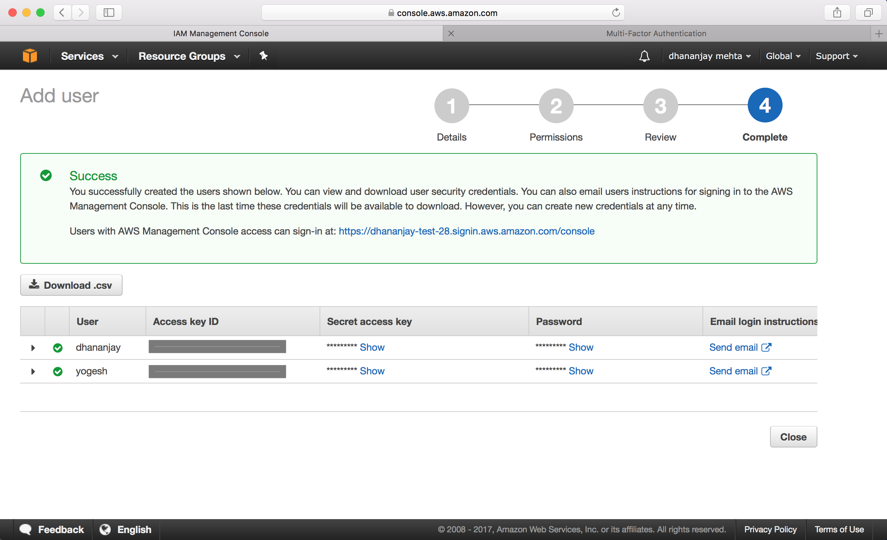

## AWS: Identity Access Management


**What is IAM?**
- AWS Identity and Access Management (IAM) is a web service that helps you securely control access to AWS resources for your users. You use IAM to control who can use your AWS resources (authentication) and what resources they can use and in what ways (authorization).
- IAM is universal and not limited to region.
- IAM offers centralized control of your AWS account.
- IAM integrates with existing active directory account allowing single sign-on.
- IAM offers fine-grained access control to AWS resources.
- IAM is a feature of your AWS account offered at no additional charge. You will be charged only for use of other AWS services by your users.

**What does IAM provide?**
- Centralized control of AWS account
- Shared Access of AWS account
- Granular permissions for individual user or service
- Identity Federation (including active directory, facebook, linkedin, google linking)
- Allow multi-factor authentication
- Provide temporary access to devices , services
- Allow to set up password rotation policy
- Support PCI-DSS compliance

**Important terms in IAM?**
Users - End users
Groups - Groups or departments in office
Roles - Roles can be created and then assigned to AWS resources. Eg. A role can be defined for EC2 instance to process data and load to S3
Policies - Policiy documents define the rules and permissions, this can be applied to individual users, groups and roles. A policy document is made  up of JSON and made of key value pair consisting of attribute and values. 

```
eg. AdministratorAccess

{
    "Version": "2012-10-17",
    "Statement": [
        {
            "Effect": "Allow",
            "Action": "*",
            "Resource": "*"
        }
    ]
}
```

**Setting up IAM**

- IAM is a global feature, it is not bound to a region
- IAM users sign in link consist of the AWS account number of parent account 
e.g. https://552619384927.signin.aws.amazon.com/console
This login link can be set to customized link => https://dhananjay-test-28.signin.aws.amazon.com/console
- Root user need to set up multifactor authentication for root user
- New users don't have any access upon creation, these users have to be assigned permissions by root.
- Access Key ID and Secret Access key are assigned to a new user, these can not be used by them on login but they can use these keys to acces AWS from their command line consoles or APIs. These keys can be used once and can be generated for a user.
- Password policy can be set up by admin.
 
Following are the steps for setting up the IAM:


**Step 1:** IAM in the AWS Dashboard
 


**Step 2:** IAM Dashboard 
 


**Step 3:** Activate Multifactor Authentication on the root
  


**Step 4:** Add new IAM Users


**Step 5:** Set type of access for each user.


**Step 6:** Add users to groups
 


**Step 7:** Assign different privileges to user groups
 


**Step 8:** Review permissions for group



**Step 9:** Users are added successfully with access assigned to users.


**Step 10:** Users can be added to more than one groups and granted additional permissions.


**Step 11:** Access can be revoked for a user or can be made inactive


**Step 12:** Admin can set up a password policy for the users


**Step 13:** After all the 5 fields are green IAM is good.


**IAM usage scenarios**
*Case 1: You are a solutions architect working for a large engineering company who are moving from a legacy infrastructure to AWS. You have configured the company's first AWS account and you have set up IAM. Your company is based in Andorra, but there will be a small subsidiary operating out of South Korea, so that office will need its own AWS environment. Which of the following statements is true?*
- You will need to configure Users and Policy Documents only once, as these are applied globally.

*Case 2: You have created a new AWS account for your company, and you have also configured multi-factor authentication on the root account. You are about to create your new users. What strategy should you consider in order to ensure that there is good security on this account.*
- Enact a strong password policy, 

*Case 3: A new employee has just started work, and it is your job to give her administrator access to the AWS console. You have given her a user name, an access key ID, a secret access key, and you have generated a password for her. She is now able to log in to the AWS console, but she is unable to interact with any AWS services. What should you do next?*
- Grant her Administrator access by adding her to the Administrators' group.

Note: A **Power user** has access to all AWS services except the management of groups and users within IAM. A **root user/account** have administrator access.

*Case 4: You are a developer at a fast growing start up. Until now, you have used the root account to log in to the AWS console. However, as you have taken on more staff, you will now need to stop sharing the root account to prevent accidental damage to your AWS infrastructure. What should you do so that everyone can access the AWS resources they need to do their jobs?*
- Create individual user accounts with minimum necessary rights and tell the staff to log in to the console using the credentials provided.
- Create a customized sign in link such as "yourcompany.signin.aws.amazon.com/console" for your new users to use to sign in with.

*Case 5: You are a security administrator working for a hotel chain. You have a new member of staff who has started as a systems administrator, and she will need full access to the AWS console. You have created the user account and generated the access key id and the secret access key. You have moved this user into the group where the other administrators are, and you have provided the new user with their secret access key and their access key id. However, when she tries to log in to the AWS console, she cannot. Why might that be?*
- You cannot log in to the AWS console using the Access Key ID / Secret Access Key pair. Instead, you must generate a password for the user, and supply the user with this password and your organization's unique AWS console login URL.

*Case 6: You have a client who is considering a move to AWS. In establishing a new account, what is the first thing the company should do?*
- Set up an account using their company email address.
