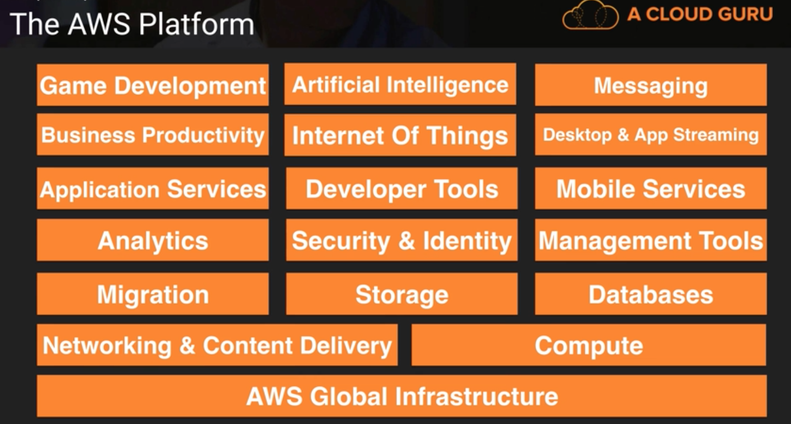

## AWS: Platform & Services
AWS cloud platform can be categorized broadly into three main models for cloud computing:
1. Infrastructure as a Service (IaaS): It provide access to networking features, computers (virtual or on dedicated hardware), and data storage space.
2. Platform as a Service (PaaS): It helps organizations to be more efficient as they don’t need to worry about resource procurement, capacity planning, software maintenance, patching, or any of the other undifferentiated heavy lifting involved in running their application.
3. Software as a Service (SaaS): It provide a completed product that is run and managed by the service provider. User do not have to think about how the service is maintained or how the underlying infrastructure is managed; you only need to think about how user will use that particular piece software.

All the services offered by AWS fall in one of the above categories. Below are are set of different services that are provided by AWS:

### A. Infrastructure Services
AWS infrastructure is split into Regions and Availability Zones

Regions(R): A geographic area where AWS resources exist, currently 15. Each R contains 2 or more AZ and these AZ provide the services

Availability Zones(AZ): A physical data center, nearly 35

Edge Location: A content delivery network, that can be used to cache the data/content for user. It is the CDN endpoint for AWS Cloudfront. There are nearly 66 Edge Location

#### VPC 
- It is a virtual Data Center in all the regions, multiple VPC / region.
- Note: Very Important topic for Associate certifications

#### Route 53  
- Amazon DNS service, Route + 53 
- here 53 is DNS port and route is after route 66

#### Cloud Front 
Caching and CDN service for large files and media services

#### Direct Connect 
Dedicated line connection, this service is not used to reduce reliability on Internet

#### EC2 (Elastic Compute Cloud) 
- This is virtual machine on AWS, provide compute resources
- EC2 Container Service (ECS) - Its basically a docker instance

#### EBS (Elastic Bean Stalk) 
- This is used to deploy and manage applications and code to AWS. 
- EBS will review the application and automatically detect deployment requirements, autoscaling, load balancing, health monitoring.
- Use other services such as EC2, S3, ELB, Autoscaling to deliver highly reliable, scalable and cost-effective infrastructure
- AWS cloud watch can be used to monitor the status and health and requirements of the application.

#### Lambda
- Allow to run application without need of a Server.
- The code is run whenever there is new data, or a new trigger for code. no charges for ideal time
- Good for real time data processing, mobile or Web apps
- Benefits: No server to manage or maintain, pay per use, no charge for idle time
- Trigger for Lambda can be generated by either kinesis, S3, Simple Notification Service, DynamoDB to trigger Lambda operation. This is due to any incoming load or change in the state
- Charging - Every 100ms code runs, or every trigger for the code.

#### Light sail 
- Allow users to deploy basic websites on Joomla or WordPress if they do not have much experience with AWS

### Storage Services
Storage services are a critical component of cloud computing, holding the information used by applications. Big data analytics, data warehouses, Internet of Things, databases, and backup and archive applications all rely on some form of data storage architecture. Cloud storage is typically more reliable, scalable, and secure than traditional on-premises storage system. Storage serviecs has 4 components - 

#### S3 (Simple Storage Service)
- Used to store objects on cloud
- Include logs, csv, txt, json and other flat files.
- Most widely used storage service

#### Glacier
- Most widely used storage for archiving, offloads file from S3 to store for long term.
- Extremely low cost storage but very slow retrieval time. Usually 3-4 hours.

#### EFS (Elastic File System)
- This is Block based service
- This can be shared between different systems on EC2 which can access the file simultaneously and update it.
- Similar to Google sheet/slide
- Pay only for files and directories used, no minimum fee or setup charge
- Durable and high availability, replicate in different AZ in a region
- With Amazon EFS, storage capacity is elastic, growing and shrinking automatically as users add and remove files.
- Allow seamless integration, scalability for work across a group of users.

#### Storage Gateway Service:
- This service connects S3 to on premise data-center
- Enables on-premises applications to seamlessly use storage in the AWS Cloud.
- Can be used for backup and archiving, disaster recovery, cloud bursting, storage tiering, and migration.
- Applications can connect to service through a gateway appliance using standard storage protocols, such as NFS and iSCSI. 
- The gateway connects to AWS storage services, such as Amazon S3, Amazon Glacier, and Amazon EBS, providing storage for files, volumes, and virtual tapes in AWS.

### Databases Services
AWS offers a wide range of database services to fit varying application requirements. AWS database services include Amazon Relational Database Service (Amazon RDS), with support for six commonly used database engines, Amazon Aurora, Amazon DynamoDB, Amazon Redshift, and Amazon Elasticache. AWS also provides the AWS Database Migration Service, a service which makes it easy and inexpensive to migrate your databases to AWS cloud.

#### RDS (Relational Database Storage)
- Offer relational data storage, with following flavors: MySql, MariaDB, PostgresQL(2016), Aurora, Oracle
- Have pre-configured image of all the database, does not require need of an administrator
- Note: Important for Associate certification

#### Aurora:
- Amazon’s own relational database system.
- Have a mySQL compatible storage engine
- provide 5X throughput compared to current RDBMS
- 1/10 cost of existing enterprise solutions and no license fee
- Read heavy applications can increase availability with data replicated across servers in less than 10ms
- Security: network isolation using VPC, data encryption in rest through AWS key management, data encryption in motion by SSL
- automated backups, snapshots and create replicas for data
- Compatible with MySQL 5.6 using InnoDB storage engine, any code used with MySQL can be used with it.
- Can replace Oracle, Postgres, SQL Server
- AWS DMS and AWS Schema Conversion tools can be used to migrate the data to Aurora
- Offer high availability, failover < 30sec, 6 copies replicated across 3 AZ and copies replicated on S3 

#### DynamoDB 
- This is No SQL data storage system on AWS
- it offers scalable storage and have competitors: Cassandra, MongoDB

#### Redshift < Data Warehouse Solution>:
- A petabyte-scale data warehouse service.
- Good storage for Big data analytics and is a OLAP (Online Analytics Processing) Database
- Running queries on production database make it slow, so queries can be run on a data warehouse. 
- Competitors: Vertica, Teradata
- Store data in columnar format, parallel process data.

#### Elastic Cache <Caching Storage>:
- An in-memory cache service with support for Memcached and Redis
- Allow fast data retrieval through data stored in memory caches, it’s in memory data cache system
- E.g. If user is interested in top 10 items in a store, it can get the result directly from cache.
- Can help to improve performance of read heavy applications as it reduce latency in returning results.
- It will take care of persistence itself
- Popular use caes: Leaderboards, Counting, Tracking, session management
- Note: Redis is better choice compared to Memcached:
 
 ref: https://stackoverflow.com/questions/10558465/memcached-vs-redis

### Migration Services
Deal with migrating data across services:

#### Snowball
- import export data over hard disk and move data on cloud
- Hardware appliance that copy data and move to S3
- It has been extended to on premise data center

#### DMS (Database Migration Service)
- allow to migrate on premise database to cloud
- allow to move data from RDS to redshift or other regions
- allow to migrate from one Database type to other Database type eg. Oracle to AURORA
- There is no downtime in migration

#### SMS (server migration service)
- allow to migrate the virtual machines on ec2
- no downtime

### Analytics Services
AWS offers a comprehensive set of services to handle every step of the analytics process chain including data warehousing, business intelligence, batch processing, stream processing, machine learning, and data workflow orchestration.

#### Athena:
- Most data is stored in S3 in multiple data format.
- This data was needed to be transformed by ETL process before being used
- Also, data needed to be aggregated before it is used if a user is not planning to use Hadoop for parallel processing.
- Athena is interactive query services which allow to query data directly from S3 using SQL.
- It is server less, no infrastructure needed, no instance, no administration needed.
- User talk to Athena using console, or using JDBC driver.
- Allow to query CSV, txt
- This include two basic steps: Create table from data sitting on S3, query the data.
- No loading of data is required form any database, no ETL required
- Load data (csv, txt, json, weblogs, service logs) to S3 => process data on Athena
- Note: If data is converted to Parquet or ORC, this will give the best result with lowest cost.
- Underlying technologies include: Presto (allow in memory distributed query processing), Hive (used for DDL Queries)

ref: https://www.youtube.com/watch?v=ihVI-MZ6xR0

#### EMR<Elastic Map Reduce>:
- Process data on warehouse with Hadoop
- provide framework to create, customize and use Hadoop cluster created with EC2 instances
- Reduce complexity of managing EC2 instances and other infrastructures.
- Can parallel process same data on S3 on different EMR clusters
- Provide full support to MapReduce, Pig Latin, Hive QL, SQL 

ref: https://www.youtube.com/watch?v=Hhj3fOdt7zo

#### ElasticSearch service:
- Make it easy to manage and deploy Elastic Search (famous for search and analytics)
- Use cases: log analytics, real-time application monitoring, click stream analytics and text search
- Ensure, high availability, patch, backup and other managements of ES.

#### Cloud Search
- Search service, where data can be captured and stored on cloud
- Infrastructure automatically scale up to capture all the logs and search terms
- Fields to be cached from data can be customized

#### Kinesis:
- Allow to work with streaming data and analyze it on real-time
- eg. log files, social network, financial data, telemetry, geo info
- challenges - scalability, concatenation before loading, encrypting and compressing data
- Capture and load real time data in s3 and redshift and process it 
- Full autonomous provisioning of the data as it arrives, from scaling to maintaining the data to processing it

ref: https://www.youtube.com/watch?v=MMJ1T9Obw0c&t=5s

#### Quick Sight:
- Business intelligence service which is faster than existing services and at 1/10th of current price. Similar to Highcharts, tableau etc.
- Look data inside S3, Redshift, RDS, and inspect the data inside the source and generate the relationships within the data.
- Allow to analyze data very fast with help of the SPICE (super-fast, parallel, in-memory, computation engine) which is a custom data layer which arrange data in a columnar format.
- This service can be integrated with Tableau, Tibco, Quilk and can be embedded into webpage or application
- This can be used to build the dashboard and can be set on user device 

ref: https://www.youtube.com/watch?v=C_eT0xRNjCs

### Security Services:

#### IAM <identity and Access Management>
- Enable securely control access to AWS services 
- Create AWS user and group and manage access to the users
- Provide access keys, permissions, policies can be attached to resources, users and groups
- Provide temporary access to users and resources.
- Attach policy to roles
- Other security measures that can be done - Restrict IP, enable Multi factor authentications (MFA), 
- Third party security can be processed with AWS Security Token Services

#### Inspector
- Automated security assessment service that finds security and compliance issue when deploying the applications on AWS
- Look at potential impact on network, OS, VM, attached network, Agent installed on virtual machine
- Provide feedback and findings to user and provide informative actions to user 

#### Certificate Manager
- AWS Certificate Manager is a service that lets you easily provision, manage, and deploy Secure Sockets Layer/Transport Layer Security (SSL/TLS) certificates for use with AWS services
- AWS Certificate Manager removes the time-consuming manual process of purchasing, uploading, and renewing SSL/TLS certificates.
- This is free service and only the resources are charged 
- Allow to centrally manage the certificates on AWS and also avoid any errors in manual update of any expired certificate.

#### Directory Service
- Allow to connect the AWS service to on campus active directory
- also allow to set up an new stand-alone directory on the cloud
- AWS resources can be accessed using the corporate credentials once the connection to the active directory is set up. this is especially good for big organizations like Accenture that have a large number of windows usage.
- This is good to set up group policy 

#### WAF <Web Application Firewall>
- Application layer security
ref: https://www.youtube.com/watch?v=yWSn5E6WQug

#### Artifacts:
- This is documentation about different documentations of various security certificates.

### Management Services

#### Cloud watch
- Used for the analysis of any logs from Elastic Load Balance, use case: when there might be huge load then the cloud watch can trigger alert
- Alarms can be customized to fit the use case.
- This is very important as this helps users/operators to add any new custom alarm whenever the user see that there was an exception that had previously led to a failure
ref: https://www.youtube.com/watch?v=xaFaVeoA9V8

#### Cloud Formation 
- Very important tool for solutions architects but don’t come in exam
- Turing infrastructure to code. 
- Used to manage resources on AWS
- Allow to create template for services and application that needs to be build on AWS
- Cloud formation will use the templates to provision(build/deploy) the services and applications called stacks
- These stacks can be replicated or modified
- This stack can range from a single EC2 instance to a complete architecture.
- The major push that Cloud Formation provide is easy to deploy the similar architecture and people with less knowledge of AWS can also use it to build things
- Provisioning of resources is completely automated by Cloud Formation all user is needed to do is add desired resources and their configuration on template.
- These templates can be modified using any version control tools and changes are picked by Cloud Formation

ref: https://www.youtube.com/watch?v=b-gwhQ6GPFQ

#### Cloud Trail
- Service that enables governance, compliance, operational auditing, and risk auditing of AWS account
- Continuously monitor, and retain events related to API calls across AWS infrastructure
- These logs are stored on S3
- Any failure or any suspicious activity can be tracked.  

#### Ops Work
- Application management solution that makes managing software application life cycle management easy
- Manage resource provisioning, configuration management, application deployment, software updates, monitoring and access control.
- Uses Chef which treats server configurations as code

ref: https://www.youtube.com/watch?v=TPc4zdFg12M

#### Trusted Advisor
- An online resource to help reduce cost, increase performance, and improve security by optimizing AWS environment. 
- Trusted Advisor provides real time guidance to help provision resources by following AWS best practices.
- This is a premium service

### Application Services
AWS provide variety of managed services to use with user applications

#### Step Functions:
- Make it easy to co-ordinate components of distributed and micro services by visualizing workflow of micro services.
- Work flow is defined in form of state machines
- Manage each function and keep order of each trail of actions.
- Application include such as active synchronization of two S3 buckets, process of waiting for human response by sending email or text and action on receiving confirmation, image tagging and thumbnails with Amazon image recognition.

ref: https://www.youtube.com/watch?v=Dh7h3lkpeP4

#### SWF (Simple Work Flow) service:
- Amazon SWF helps developers build, run, and scale background jobs that have parallel or sequential steps. You can think of Amazon SWF as a fully-managed state tracker and task coordinator in the Cloud.
- If your app steps take more than 500 milliseconds to complete, you need to track the state of processing, and you need to recover or retry if a task fails, Amazon SWF can help you.

#### API Gateway:
- Amazon API Gateway is a fully managed service that makes it easy for developers to create, publish, maintain, monitor, and secure APIs at any scale.
- Amazon API Gateway handles all the tasks involved in accepting and processing up to hundreds of thousands of concurrent API calls, including traffic management, authorization and access control, monitoring, and API version management.

#### AppStream: 
ref: https://www.youtube.com/watch?v=qAFlv1m3MX0

### Elastic Transcoder:
- Allow transcoding of media file and transfer them to other devices
- Handle high volume of transcoding in parallel 

ref: https://www.youtube.com/watch?v=wSYHdt1TJVQ

### Developer Tools:
AWS Developer Tools is a set of services designed to enable developers and IT operations professionals practicing DevOps to rapidly and safely deliver software. Together, these services help to securely store and version control your application's source code and automatically build, test, and deploy your application to AWS or your on-premises environment. User can use AWS CodePipeline to orchestrate an end-to-end software release workflow using these services and third-party tools or integrate each service independently with your existing tools. Some of these tools have been mentioned below

1. **Code Commit:** AWS CodeCommit is a fully-managed source control service that makes it easy for companies to host secure and highly scalable private Git repositories. 

2. **Code Build:** AWS CodeBuild is a fully managed build service that compiles source code, runs tests, and produces software packages that are ready to deploy. With CodeBuild, user don’t need to provision, manage, and scale your own build servers. 

3. **Code Deploy:** AWS CodeDeploy is a service that automates code deployments to any instance, including Amazon EC2 instances and servers running on-premises. AWS CodeDeploy makes it easier to rapidly release new features, helps avoid downtime during application deployment, and handles the complexity of updating your applications.

4. **Code Pipeline:** AWS CodePipeline is a continuous integration and continuous delivery service for fast and reliable application and infrastructure updates. CodePipeline builds, tests, and deploys the code every time there is a code change, based on the release process models you define. 

### Mobile Service:
Mobile services help to develop mobile apps that can scale to hundreds of millions of users, and reach global audiences
1. **Mobile Hub:** AWS Mobile Hub guides user through feature selection and configuration, automatically provisions the AWS services required, and generates working code that helps user integrate the Mobile SDK with their app in minutes.

2. **Cognito:** Amazon Cognito allow developer to easily add user sign-up and sign-in to their mobile and web apps. With Amazon Cognito, user also have the options to authenticate users through social identity providers such as Facebook, Twitter, or Amazon, with SAML identity solutions, or by using your own identity system.

3. **Device Farm:** AWS Device Farm is an app testing service that lets you test and interact with your Android, iOS, and web apps on many devices at once, or reproduce issues on a device in real time

4. **Mobile Analytics:** With Amazon Mobile Analytics, developer can measure app usage and app revenue. By tracking key trends such as new vs. returning users, app revenue, user retention, and custom in-app behavior events, developer can make data-driven decisions to increase engagement and monetization for their app

5. **Pinpoint:** Analytics of end point on device, decide what notifications to send, targeted marketing

### Artificial Intelligence:
1. **Alexa Voice Service:**  This service add intelligent voice control to any connected product that has a microphone and speaker. User of the product will be able to ask Alexa to play music, answer questions, get news and local information, control smart home products, and more on their voice-enabled products. This can be embedded in devices and do not require dedicated Echo device. 

2. **Polly:**  Amazon Polly is a service that turns text into lifelike speech. Amazon Polly lets you create applications that talk, enabling you to build entirely new categories of speech-enabled products. 

3. **Machine Learning:** Amazon Machine Learning is a service that makes it easy for developers of all skill levels to use machine learning technology. Amazon Machine Learning provides visualization tools and wizards that guide you through the process of creating machine learning (ML) models without having to learn complex ML algorithms and technology. 

4. **Rekognition:** Amazon Rekognition is a service that makes it easy to add image analysis to applications. With Rekognition, you can detect objects, scenes, faces; search and compare faces; and identify inappropriate content in images. 

### Messaging Services
The messaging services provide mean to send notification to devices and different component.
ref: https://aws.amazon.com/sns/

#### SQS (Simple Queue Service)
- SQS is a fully managed message queuing service that makes it easy to decouple and scale microservices, distributed systems, and serverless applications. 
- Building applications from individual components that each perform a discrete function improves scalability and reliability, and is best practice design for modern applications. 
- SQS makes it simple and cost-effective to decouple and coordinate the components of a cloud application. 
- SQS allow to send, store, and receive messages between software components at any volume, without losing messages or requiring other services to be always available.
- SQS FIFO queues are designed to guarantee that messages are processed exactly once, in the exact order that they are sent, with limited throughput.
- SQS standard queues offer maximum throughput, best-effort ordering, and at-least-once delivery.

#### SNS (Simple Notification Service)
- A flexible, fully managed pub/sub messaging and mobile notifications service for coordinating the delivery of messages to subscribing endpoints and clients
- Allow to broadcast messages to a large number of subscribers, including distributed systems and services, and mobile devices.

