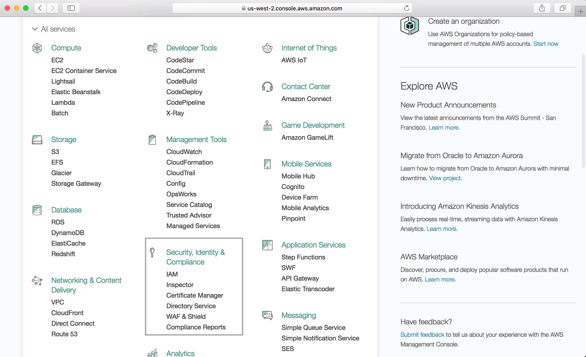
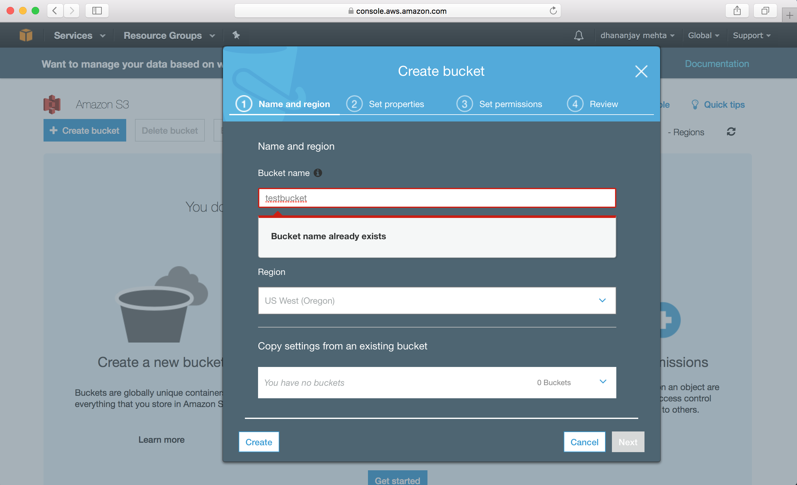
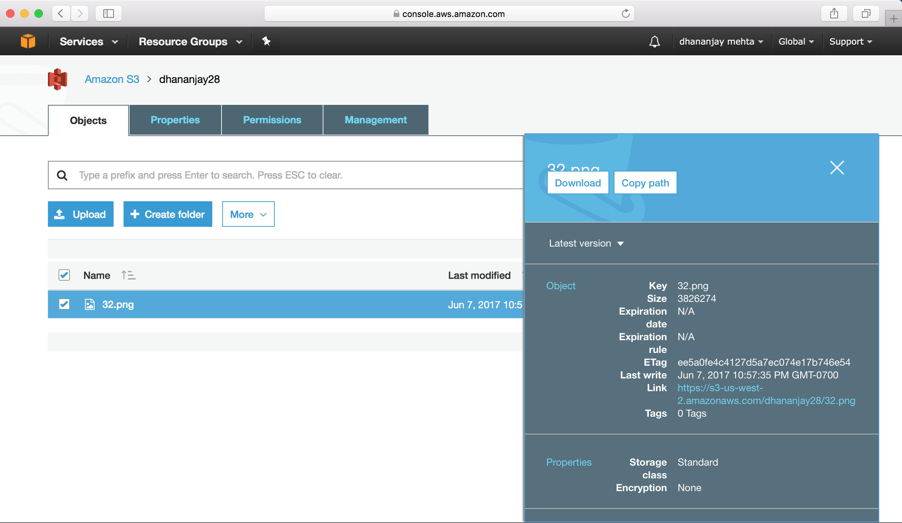

## AWS : Simple Storage Service (S3)

- S3 is Object based storage which means this can be only used for standalone / independent files and not for installing any operating system, data base or any other applications. 
- Data is spread across multiple devices and storage
- 0-5TB file size and have unlimited storage
- files are stored in a bucket. A Bucket is synonymous to Folder
- S3 is a universal namespace, which mean bucket name has to be unique
- A bucket name is a url with following component:
 
 https://s3-
 s3 + region + bucket name
- File upload code : 200(successful upload),  

#### S3: Data consistency model
- Read and write consistency for put (upload) operation. These operations are ACID
- Eventual consistency for Update and Delete.

#### S3 : a key value store
S3 is a object based storage where files are stored as key-value store
- key: when data is loaded to S3, a key is created which is name of the file
- value: data or sequence of bytes making the file
- Version: S3 support versions and backing up of files. S3 is designed to be lexicographic i.e. files sorted in alphabetic order. This can be a important design consideration because if you have logs data, data is stored with similar starting name. So, to get rid of this a random character added to the beginning of file name else files with similar name will be located close by hence there will be bottleneck in retrieval
- Subresource - underneath of object, have access control list that allow to set fine grain permission on individual user, file 
- Torrent - S3 supports this protocol
- AWS has 99.99% SLA for availability and 99.999999999% or 11X9s durability on S3 data.
- Support for tiered storage, this allow to move data to cheaper storage after certain time
- Support for versioning
- Allow encryption of data
- Data security through ACL (Access Control List) and Bucket Policies

#### S3: Storage Tiers
- S3: High availability, High durability, replicated across multiple locations and can withstand two simultaneous failures.
- S3 IA(Infrequent Accessed): If data less frequently used but also need quick access. Lower cost than S3 but retreial fee charged
- RRD (Reduced Redundancy Storage): Cheaper than S3, has lower durability. Best fit for a case where data can be recovered.
- Glacier: Cheapest and used strictly for archival, access time 3-5 hours, cost nearly $0.01/GB   

**Fig.** *Difference between S3/S3 IA/ RRD*

**Fig.** *Difference between S3/S3 IA/Glacier*

#### S3: Charges
Upload to S3 is free but following things are charged on S3 - 
  1. Storage of the data uploaded.
  2. Request - number of request being made to objects in S3
  3. Storage Management Pricing - this pricing is for managing storage on S3  ref: https://aws.amazon.com/cloudtrail/pricing/
  4. Data Transfer Pricing: If data is transferred withing the AWS e.g. moving or replicating data one region to other.
  5. Transfer Acceleration: Enable fast and easy file transfer between long distance locations between end user and S3 bucket. This uses service of cloudfront.

#### S3: Transfer Acceleration
Amazon S3 Transfer Acceleration enables fast, easy, and secure transfers of files over long distances between your client and an S3 bucket. Transfer Acceleration takes advantage of Amazon CloudFront’s globally distributed edge locations. As the data arrives at an edge location, data is routed to Amazon S3 over an optimized network path.
**Why use it?** If there are users that upload data to a centralized bucket from all over the world e.g video collaboration sites,  there is a transfer of gigabytes to terabytes of data on a regular basis across continents.

#### S3: Setting up a S3 bucket
**Step 1.** Select S3 under storage services from AWS dashboard.

**Step 2.** Select create bucket, no matter what region is selected, S3 bucket is provisioned globally

**Step 3.** Select a unique name for the bucket else it will through name error

Note: Only lowercase letters are allowed to name the bucket. 

**Step 4.** Set additional properties of the bucket if needed.
Additional properties can be enabled to include logging(log reports such as access reports), versioning(different versions of a file in a bucket), tagging(can be used for cost control), replication(across regions), events(notification for any upload), static website hosting etc.

**Step 5.** Upload files to S3

**Step 6.** Properties of the object can be changed.

